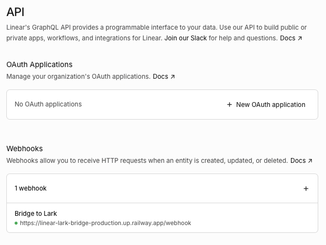
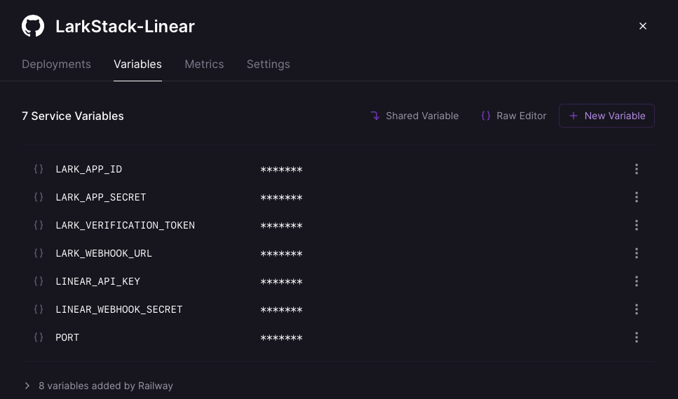

  <a href="./README.md">English</a> | <strong>简体中文</strong>

 

<h1 align="center">LarkStack-Linear 🌉</h1>

  基于 <strong>Rust</strong> 构建的高性能、类型安全的中间件，将 <a href="https://linear.app/">Linear</a> 的动态无缝同步至<a href="https://larksuite.com/">飞书</a>。
   
  由 Axum 0.8 & Tokio 强力驱动，实现毫秒级工作流整合。

  
  
  
  

## ✨ 核心特性

- 📢 **群组动态广播 (Phase 1)**：实时监听 Linear Webhook，生成按优先级变色的飞书 Interactive Card（例如：Urgent = 红色，High = 橙色）。底层自带 **500ms 防抖 (DebounceMap)** 机制，完美合并高频更新，拒绝消息轰炸。

  
   
  <i>Linear 动态实时推送至飞书群组的交互式卡片效果展示。</i>

- 👤 **精准私聊提醒 (Phase 2)**：当 Issue 被分配时，自动提取邮箱并通过飞书 Bot API 发送私聊。直接进行底层邮箱映射，彻底免除手动维护用户 ID 表的烦恼！
- 🔗 **富文本链接预览 (Phase 3)**：原生处理飞书 `url_verification` 握手挑战。在飞书中粘贴 `linear.app` 链接，系统会自动通过 Linear GraphQL API 抓取详情并展开为精美的预览卡片。
- 🛡️ **金融级安全校验**：全链路引入 HMAC-SHA256 严密验签，防止任何伪造的 Webhook 请求。

## 🏗️ 架构与技术栈

经过深度重构，代码库实现了高内聚低耦合的模块化设计：
- **核心框架**：`axum 0.8` + `tokio` (全特性异步运行时) + `reqwest 0.12`。
- **路由解耦**：完全隔离 `POST /webhook` (处理 Linear 侧) 与 `POST /lark/event` (处理飞书侧) 业务流。
- **飞书模块化**：纯函数构建器 `cards.rs` 与带有 Token 缓存的异步网络层 `bot.rs` 完美分离。

### API 路由节点
| Method | Path | 用途 |
| :--- | :--- | :--- |
| `POST` | `/webhook` | 接收 Linear Webhook |
| `POST` | `/lark/event` | 接收飞书事件回调 (Challenge 验证 + 链接预览) |
| `GET`  | `/health` | 健康检查 (返回 `"ok"`) |

## ⚙️ 环境变量配置

请确保在运行或部署前注入以下环境变量（本地调试可使用 `.env` 文件）：

  
   
  <i>在 Linear 的 Workspace Settings 中配置 Webhook 密钥及个人 API Key。</i>

| 变量名 | 是否必填 | 作用描述 |
| :--- | :---: | :--- |
| `LINEAR_WEBHOOK_SECRET` | ✅ | 用于验证 Webhook 的 HMAC 签名 |
| `LINEAR_API_KEY` | Phase 3 需要 | 用于 GraphQL API 获取链接预览详情 |
| `LARK_WEBHOOK_URL` | ✅ | 接收群组通知的机器人 Webhook 地址 |
| `LARK_APP_ID` | Phase 2 需要 | 飞书自建应用的 App ID（获取 Tenant Token） |
| `LARK_APP_SECRET` | Phase 2 需要 | 飞书自建应用的密钥 |
| `LARK_VERIFICATION_TOKEN`| Phase 3 需要 | 用于飞书事件回调的 Challenge 握手验证 |
| `PORT` | ❌ | Axum 监听端口 (默认 `3000`) |

## 🚀 极速部署 (Railway)

本项目已为 [Railway](https://railway.app/) 深度优化。内置多阶段构建的 `Dockerfile`，确保镜像体积最小化及秒级启动。

  
   
  <i>极其丝滑的云原生体验：在 Railway 面板一键注入所有环境变量即可上线。</i>

## 💻 本地开发与无损调试

1. **构建沙盒环境**：拉一个只有你自己的飞书测试群并添加专属 Bot。在 Linear 中新建一个 "Local Debug" Webhook。
2. **内网穿透**：使用 `ngrok http 3000` 将本地服务暴露至公网。
3. **启动服务**：执行 `cargo run`，并将 ngrok 的公网域名填入 Linear 的测试 Webhook 中。
4. **严苛的代码门禁**：本项目配置了 `prek` 作为本地门禁，并依赖 GitHub Actions 执行严格的 CI 流水线 (`cargo clippy -- -D warnings`)，确保每一行提交都符合高标准工程规范。

## 📝 开源协议

[MIT License](./LICENSE)